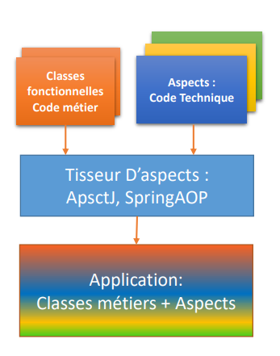

# Programmation Orientée Aspect SpringAOP
## Aspect Oriented Programming
- Aspect Oriented Programming or AOP is a programming paradigm that allows you to deal separately
  - Cross-cutting concerns (Cross Cutting Concerns), which often relate to technical aspects (Logging, Security, Transaction, etc.)
  - business concerns, which constitute the heart of an application.
- Allows to separate the business code from the technical code
                             
## Application : SpringAOP
- Creation of an application that offers two basic business functions:
  - A process operation () to perform any processing
  - An operation allowing to return any calculation result.
  - Then we define two aspects based on Spring AOP
   - An Aspect for logging with an @Log annotation which allows to mark in the layer the method to be logged
   - An Aspect to secure the application with basic authentication with roles. To secure access to a method, we define a @SecuredByAspect annotation (roles = ["ADMIN", "USER"]) which will be placed on the methods to be secured by specifying the required roles.
                              
## Resource 
## 3) Source
for more details consult the following sources
- demo video  [Programmation Orientée course and demo ](https://youtu.be/O7D8wcVtdUM)
### Enjoy !!